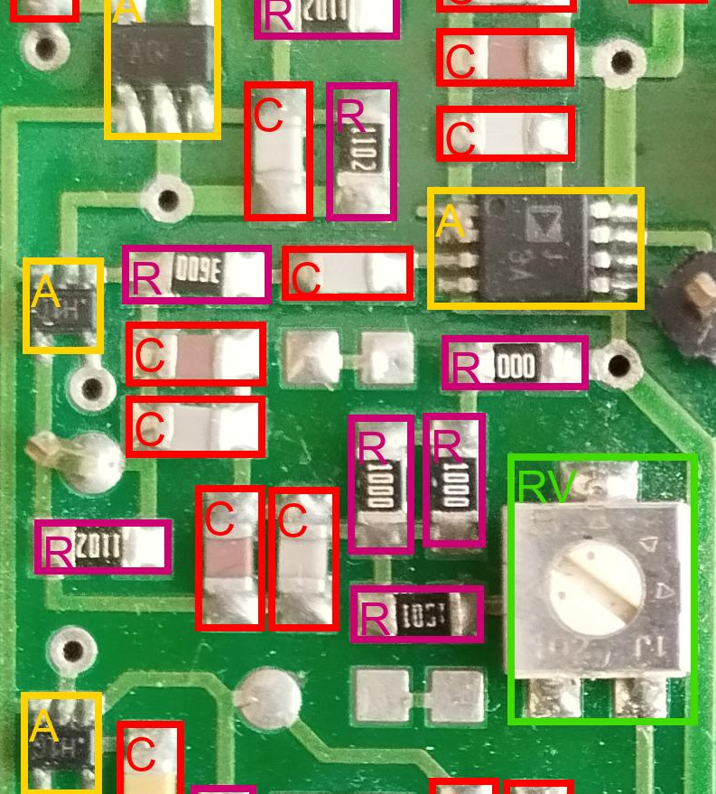

# Привет, меня зовут Дмитрий Кауфман 👋

- Закончил РГУ нефти и газа (НИУ) им. И.М. Губкина по напрвлению "Информационно-измерительные системы"
- Сейчас продолжаю обучение в магистратуре по направлению "Информационно-измерительные системы в нефтегазовой отрасли"
- Занимаюсь машинным обучением и хочу погрузиться в Data Science
- Работаю над [проектом](https://github.com/KaufmanDmitriy/pcb-detection) "Система контроля качества сборки печатных плат"

## Контакты
 kfmn.dmitriy@gmail.com         
[Telegram](https://t.me/KaufmanDmitriy)

## Tech stack
**Языки программирования:**
Python, SQL, VBA

**СУБД:**
PostreSQL, MySQL

**Data Science:**
Python, Pandas, Numpy, Matplotlib, Scikit-learn, PyTorch, LightGBM, CatBoost

## Проекты

### [Система контроля качества сборки пеатных плат](https://github.com/KaufmanDmitriy/pcb-detection)

